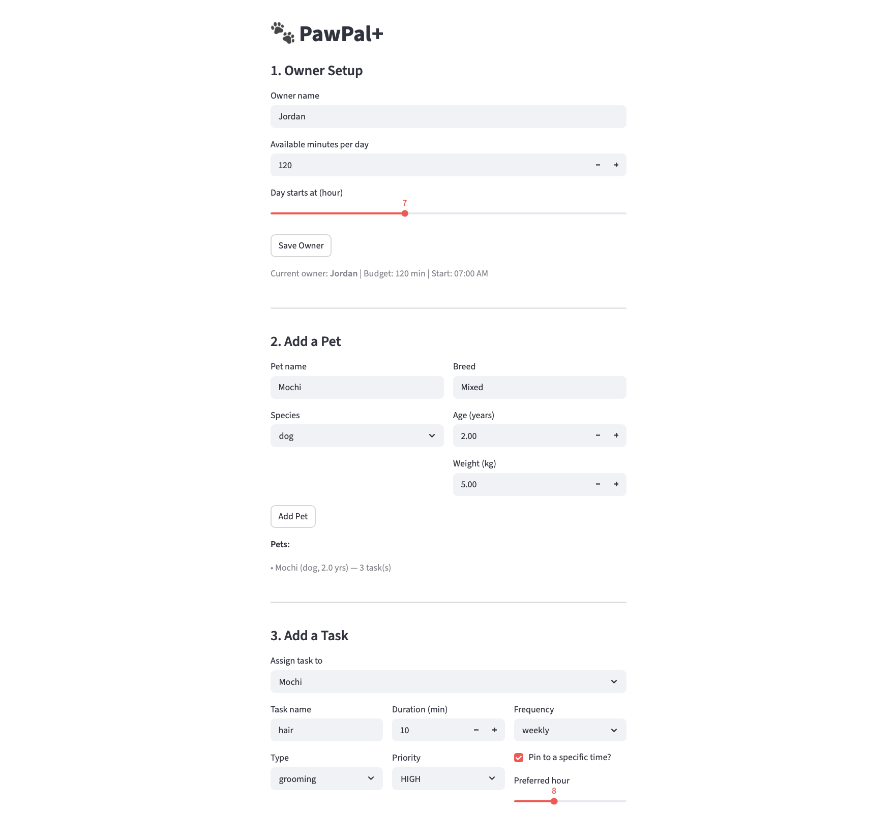
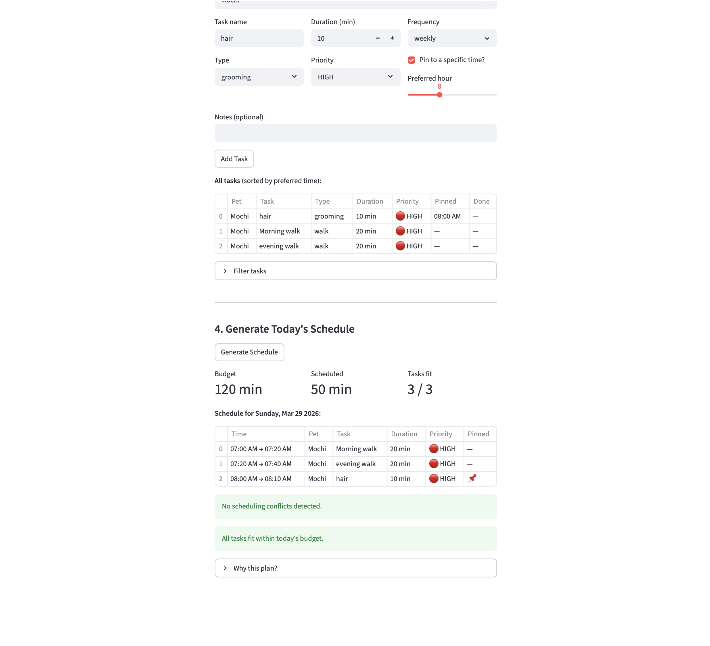

# PawPal+ (Module 2 Project)

You are building **PawPal+**, a Streamlit app that helps a pet owner plan care tasks for their pet.

## Scenario

A busy pet owner needs help staying consistent with pet care. They want an assistant that can:

- Track pet care tasks (walks, feeding, meds, enrichment, grooming, etc.)
- Consider constraints (time available, priority, owner preferences)
- Produce a daily plan and explain why it chose that plan

Your job is to design the system first (UML), then implement the logic in Python, then connect it to the Streamlit UI.

## What you will build

Your final app should:

- Let a user enter basic owner + pet info
- Let a user add/edit tasks (duration + priority at minimum)
- Generate a daily schedule/plan based on constraints and priorities
- Display the plan clearly (and ideally explain the reasoning)
- Include tests for the most important scheduling behaviors

## Getting started

### Setup

```bash
python -m venv .venv
source .venv/bin/activate  # Windows: .venv\Scripts\activate
pip install -r requirements.txt
```

### Suggested workflow

1. Read the scenario carefully and identify requirements and edge cases.
2. Draft a UML diagram (classes, attributes, methods, relationships).
3. Convert UML into Python class stubs (no logic yet).
4. Implement scheduling logic in small increments.
5. Add tests to verify key behaviors.
6. Connect your logic to the Streamlit UI in `app.py`.
7. Refine UML so it matches what you actually built.


### Smart Scheduling

PawPal+ uses a priority scheduler to build a daily care plan within the owner's available time budget. Tasks are ranked by priority level (HIGH, MEDIUM, LOW) with a bonus for time-sensitive tasks that have a pinned preferred time, such as medications. Pinned tasks are placed at their exact times first; remaining tasks fill the gaps sequentially. The scheduler also detects time conflicts between any two overlapping slots and returns plain-language warnings without crashing. Recurring tasks (daily or weekly) automatically generate their next occurrence when marked complete, using `timedelta` to calculate the due date. Tasks can be filtered by completion status or pet name, and sorted chronologically, making it easy to query exactly what still needs to happen and when. 

### Testing PawPal+

Command to run tests: python -m pytest

What the test cases cover:

| Group | Tests | What they verify |
|---|---|---|
| **Happy paths** | 3 | Full plan fits, priority order, pinned time respected |
| **Recurrence** | 4 | Daily +1 day, weekly +7 days, AS_NEEDED → None, auto-registers on pet |
| **Sorting** | 2 | Chronological order, unpinned tasks sink to end |
| **Conflict detection** | 4 | Overlap caught, back-to-back not flagged, same start caught, clean plan = no warnings |
| **Empty/zero edge cases** | 5 | No tasks, no pets, zero budget, exact fit, over budget |
| **Filter edge cases** | 3 | No args returns all, unknown pet name, completed=True filter |


Confidence Level : 4.5 Stars


### Features


- **Priority-first greedy scheduling** — tasks are ranked by `Priority` enum value (HIGH=3, MEDIUM=2, LOW=1) and selected in order until the owner's daily time budget is exhausted. Higher-priority tasks are always scheduled before lower ones, regardless of insertion order.

- **Time-sensitive task pinning** — tasks with a `preferred_time` (e.g. medications at 8:00 AM) are anchored to their exact time slot. Free tasks fill the remaining gaps sequentially without displacing pinned ones.

- **Time-sensitivity scoring bonus** — tasks with a pinned `preferred_time` receive a +1 score bonus on top of their priority level, ensuring they beat same-priority unpinned tasks in the scheduling queue.

- **Chronological sorting** — `sort_by_time()` sorts any task list by `preferred_time` ascending using a lambda key. Tasks without a preferred time receive a sentinel value of `time(23, 59)` so they sink to the end rather than raising a `TypeError`.

- **Task filtering** — `filter_tasks()` narrows a task list by completion status (`completed=True/False`), pet name (case-insensitive), or both simultaneously. Passing `None` for either argument skips that filter entirely.

- **Conflict detection** — `detect_conflicts()` runs an O(n²) pairwise check over all `ScheduledTask` objects using `overlaps_with()`. Returns a plain-language warning string per conflict without raising exceptions. Back-to-back tasks (one ends exactly when the next begins) are not flagged as conflicts.

- **Automatic daily/weekly recurrence** — `mark_complete()` on a recurring task returns a new `Task` instance with the next `due_date` calculated via `timedelta` (DAILY → +1 day, WEEKLY → +7 days). `AS_NEEDED` tasks return `None`. `mark_task_complete()` on the `Scheduler` automatically registers the next occurrence on the pet's task list.

- **Unscheduled task tracking** — tasks that exceed the remaining time budget are placed in `DailyPlan.unscheduled_tasks` rather than silently dropped, making it clear to the owner what didn't fit and why.

- **Human-readable reasoning log** — `_build_reasoning()` generates a plain-English explanation of every scheduling decision, accessible via `DailyPlan.get_explanation()` and surfaced in the UI under "Why this plan?".

### App Screenshots

**Owner setup, pet management, and task table with priority color coding:**



**Generated daily schedule with conflict detection and feasibility summary:**


