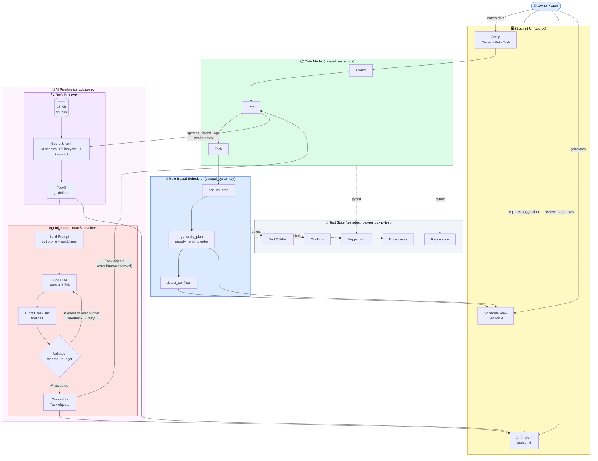

# PawPal+ — System Diagram

---

## How to read this diagram

The diagram shows data flowing **top → bottom** through five tiers.

### Tier 1 — Human
The owner drives everything. They enter their profile, request AI suggestions, approve those suggestions, and trigger schedule generation.

### Tier 2 — Streamlit UI (`app.py`)
Three logical panels: **Setup** (owner/pet/task forms), **AI Advisor** (Section 5), and **Schedule View** (Section 4). All state is stored in `st.session_state`.

### Tier 3 — Data Model (`pawpal_system.py`)
The core objects: `Owner` holds a list of `Pet`s, each `Pet` holds a list of `Task`s. Every task created — whether manually or by AI — ends up here.

### Tier 4a — AI Pipeline (`ai_advisor.py`)

**RAG Retriever** — Before any LLM call, the pet's species, lifecycle stage, and breed/health keywords are used to score all 18 knowledge-base chunks. The top-6 are injected verbatim into the prompt, so the model reasons from evidence rather than memorised facts.

**Agentic Loop** — The LLM is given a single tool (`submit_task_list`) it *must* call (forced via `tool_choice="required"`). After each call the system runs two automated checks:
- **Schema validation** — are enum values, integer ranges, and time formats correct?
- **Budget check** — does the total duration fit the owner's daily time budget?

If either check fails, a feedback message is appended to the conversation history and the model is asked to revise. This loop runs up to **3 times**. On acceptance, `_dict_to_task()` converts the JSON to real `Task` objects.

### Tier 4b — Rule-Based Scheduler (`pawpal_system.py`)
Purely deterministic. `sort_by_time` orders tasks chronologically (pinned tasks first, unpinned last). `generate_plan` greedily picks tasks high-to-low priority until the time budget is full. `detect_conflicts` scans every pair of scheduled slots for overlaps.

### Tier 5 — Test Suite (`tests/test_pawpal.py`)
22 pytest tests cover the data model and scheduler directly (dotted lines = "verifies"). The AI pipeline is not unit-tested here — its reliability comes from the schema validator and budget checker inside the agentic loop itself.
